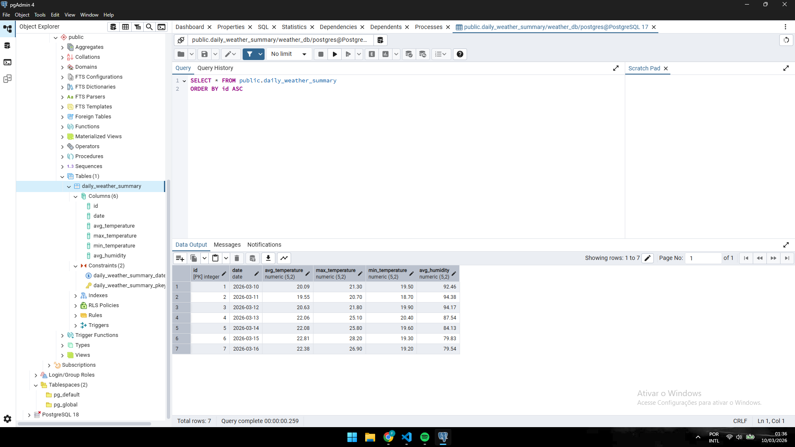
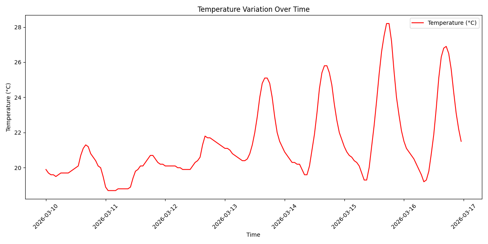
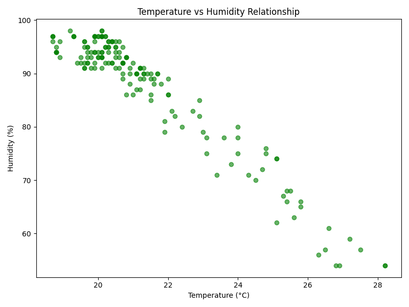

# 🌤️ Weather ETL Pipeline & Analytics


A complete Extract, Transform, Load (ETL) pipeline developed in Python. This project consumes meteorological data from the Open-Meteo REST API, processes and aggregates the information using Pandas, and securely loads the structured data into a PostgreSQL relational database. It also features a data visualization module using Matplotlib.

## 📌 Project Architecture

The pipeline was structured in modular layers to ensure scalability and Data Engineering best practices:

1. **Extract (`extract.py`):** Consumes raw data (JSON) from the Open-Meteo API and stores it locally to isolate network requests.
2. **Transform (`transform.py`):** Reads the extracted data, converts data types (Timestamps), and applies business rules using Pandas aggregations (`groupby`, `agg`) to calculate the daily mean, maximum, and minimum values.
3. **Load (`load.py`):** Connects securely to PostgreSQL using environment variables (`.env`). Performs batch inserts with conflict handling (`ON CONFLICT DO UPDATE`) to ensure pipeline idempotency and prevent data duplication.
4. **Visualization (`plot.py`):** An analytical module that generates time series and scatter plots to identify weather patterns and trends.

## 🛠️ Technologies Used

* **Language:** Python
* **Data Manipulation & Analysis:** Pandas
* **Database:** PostgreSQL
* **DB Connector:** psycopg2-binary
* **Data Visualization:** Matplotlib
* **API Requests:** Requests
* **Security:** python-dotenv

## 🗄️ Database Modeling (PostgreSQL)

The transformed data is loaded into a relational schema optimized for historical analysis.

* **Table:** `daily_weather_summary`
* **Primary Key:** `id` (Serial)
* **Unique Constraint:** `date` (Prevents duplicate records if the script runs multiple times on the same day)

> **Visualization of the persisted data:**
<br>


## 📊 Visual Insights

The project automatically generates visual analyses to better understand weather behavior over time.

### Temperature and Humidity Variation
<div style="display: flex; gap: 10px;">
  
  
</div>

## 🚀 How to Run the Project Locally

**1. Clone the repository**
```bash
git clone [https://github.com/FernandoTinno/Api_tempo.git](https://github.com/FernandoTinno/Api_tempo.git)
cd weather-etl-pipeline
```

**2. Create and activate a virtual environment (venv)**
```bash
python -m venv venv

# On Windows:
venv\Scripts\activate

# On Linux/Mac:
source venv/bin/activate
```

**3. Install the dependencies**
```bash
pip install -r requirements.txt
```

**4. Create an .env**
```bash
Follow the example in .env.example and make an .env with the instructions of .env.example
```
**5. Execute**
```bash
Execute the main.py file
```